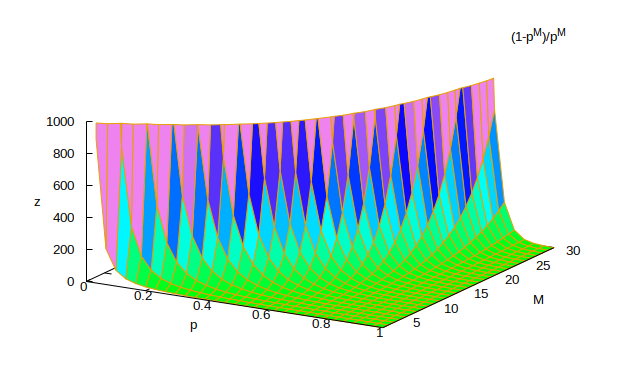

# Full Alphabet

The game is not just a single letter, but an alphabet of *M* letters, with restarts after any crashes.

## Description

To solve, we'll use a general "recurrence" approach:

This means:

* We sum over all the lengths of *wins < M* with then a loss
  * chance is \\(p_{win}\^i\\,p_{loss}\\)
  * contribution to whatever quantity is
    * i * wins
    * 1 loss
    * Game expected quantity (for restart)
* and add the *M* straight wins case
  * chance \\(p_{win}\^M\\)
  * *M* * wins

\\(Quantity = \sum_{i=0}\^{M-1}{p_{win}}\^ip_{loss}(i\\,q_{win}+q_{loss}+Quantity)+{p_{win}}\^M(M\\,q_{win}+q_{victory})\\)

Explanation:

* \\(Quantity\\) is what we're assessing (like probability, time, ...)
* \\(q_{win}\\) is the value of a step win
* \\(q_{loss}\\) is the value of a step loss
* \\(q_{victory}\\) is the value of a total win
* \\(q_{failure}\\) *is not needed since this game always eventually completes*

----

## Simplification

We can do some simplification using the formula for a [geometric series](https://en.wikipedia.org/wiki/Geometric_series)

\\(\sum_{i=0}\^{M-1}{p_{win}}\^i = \frac{1-{p_{win}}^M}{1-p_{win}} = \frac{1-{p_{win}}^M}{p_{loss}}\\)

So:

\\(Quantity = \sum_{i=0}\^{M-1}{p_{win}}\^ip_{loss}i\\,q_{win}+\sum_{i=0}\^{M-1}{p_{win}}\^ip_{loss}q_{loss}+\sum_{i=0}\^{M-1}{p_{win}}\^ip_{loss}Quantity+{p_{win}}\^M(M\\,q_{win}+q_{victory})\\)

Becomes:

\\(Quantity = \sum_{i=0}\^{M-1}{p_{win}}\^ip_{loss}i\\,q_{win}+(1-{p_{win}}^M)q_{loss}+(1-{p_{win}}^M)Quantity+{p_{win}}\^M(M\\,q_{win})+{p_{win}}\^M\\,q_{victory}\\)

Solving for *Quantity*

\\({p_{win}}^M Quantity = q_{win}\\,p_{loss}\sum_{i=0}\^{M-1}{i\\,{p_{win}}\^i}+q_{loss}\\,(1-{p_{win}}^M)+M\\,q_{win}\\,{p_{win}}\^M+q_{victory}\\,{p_{win}}\^M\\)

The series i*p^i also has a closed-form expression:

\\(\sum_{i=0}\^{M-1}{i\\,{p_{win}}\^i} = \frac{(M-1){p_{win}}^{M+1}-M{p_{win}}^M+p_win}{(1-p_{win})^2}\\)

Substituting and combining with the last term:

\\({p_{win}}^M Quantity = q_{win}\frac{p_{win}-{p_{win}}^{M+1}}{1-p_{win}}+q_{loss}\\,(1-{p_{win}}^M)+q_{victory}\\,{p_{win}}\^M\\)

-----------------
## Solution 
Finally:

\\(Quantity = \left(\frac{1-{p_{win}}^M}{{p_{win}}^M}\right)\left(q_{loss}+\frac{p_{win}}{1-p_{win}}q_{win}\right)+q_{victory}\\)

----------
## Analysis

### Components

There are 3 components of *Q*
 
\\(Quantity = \left(\frac{1-{p_{win}}^M}{{p_{win}}^M}\right)\left(q_{loss}+\frac{p_{win}}{1-p_{win}}q_{win}\right)+q_{victory}\\)

#### The only part that contains *M* -- the alphabet length

\\(\left(\frac{1-{p_{win}}^M}{{p_{win}}^M}\right)\\)

#### The part that depends just on a single step

\\(\left(q_{loss}+\frac{p_{win}}{1-p_{win}}q_{win}\right)\\)

#### Constant victory component

\\(q_{victory}\\)

----------------

### Compounding

As *M* (alphabet length) increases, so does *Quantity* both to infinity. 

The reason is that we are looking at the *future value* of *Quantity*
 
\\(Quantity = \left(\frac{1-{p_{win}}^M}{{p_{win}}^M}\right)\left(q_{loss}+\frac{p_{win}}{1-p_{win}}q_{win}\right)+q_{victory}\\)

If we think of \\(1/p_{win}\\) as the return rate of an investment, then \\({p_{win}}^M\\,Quantity\\) is the *present value*.

Rearrange:

\\({p_{win}}^M\\,Quantity = \left(\frac{1-{p_{win}}^M}{1-p_{win}}\right)\left((1-p_{win})\\,q_{loss}+p_{win}\\,q_{win}\right)+{p_{win}}^M\\,q_{victory}\\)

Or:

\\(Present(Quantity) = \left(\frac{1-{p_{win}}^M}{1-p_{win}}\right)\left((1-p_{win})\\,q_{loss}+p_{win}\\,q_{win}\right)+Present(q_{victory})\\)

Now:

\\(Stepvalue=\left((1-p_{win})\\,q_{loss}+p_{win}\\,q_{win}\right)\\)

And reversing the geometric series:

\\(Present(Quantity) = \left(1+p_{win}+{p_{win}}^2+\dots+{p_{win}}^{M-1}\right)\\,Stepvalue+Present(q_{victory})\\)

This is another way of looking at the game: The current value of an annuity rather than the cumulative future value.

