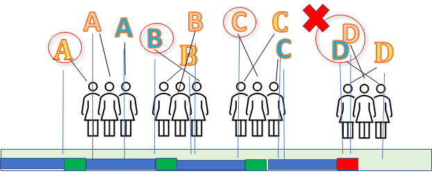

# Letter Crash Game

Another inspiration from my friend DSK (see [Foxholes](https://github.com/alfille/foxholes.github.io)) this is the **Letter Crash** game.

Here's the game:

**Goal**: Get through the alphabet, one letter at a time. Several people participate.

**Each letter**: Everyone waits a random amount of time, say from 0 to 3 seconds, then calls out the letter.

**Success**: Someone calls out the letter, and no one else calls it out within a small interval (say 1 second).

**Failure**: A **CRASH** -- two people calling out the letter too close in time.

**Restart**: After a crash, you have to start at the beginning of the alphabet all over again!

**Question**: How long should that random interval be to get through the alphabet the fastest (on average)?

_____
So in the picture above, 3 participants, and the crash happens at *D*.
________
Too short an interval, eveyone likely to crash.

Too long an interval, too much wasted time waiting for anyone to call out a letter.
_________
**No cheating** -- everyone has to play by the same rules, and everyone has to choose their time randomly and independently during that interval.
 
