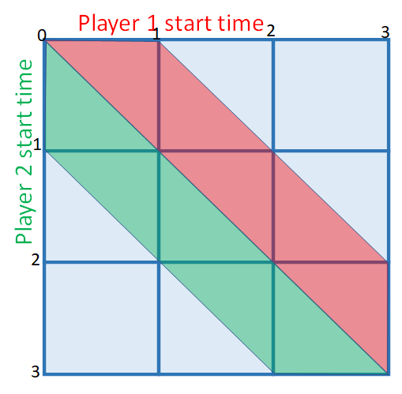

# Graphical Solution

DSK has a very inventive solution for the single letter step, at least for the 2-person game:

### Explantation

This is for 2 players, time interval random over 3 seconds, and 1 second lockout.

Player 1 (in red) starts any time within that 3 seconds, and the red area is locked out.

Player 2 (in green) starts any time within that 3 seconds, and the green area is locked out.

Chance of winning: Blue area/total = 4/9

### Extension to different intervals:

If the interval is *T* instead of 3 seconds, the "blue area" will be:

\\( \frac{(T-1)^2}{T^2}\\)

### Does it scale?
This graphical solution is very clever. But what about more than 2 people? And what is the everage time?

For that, we need to delve into the math.
