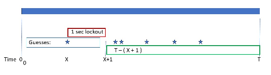
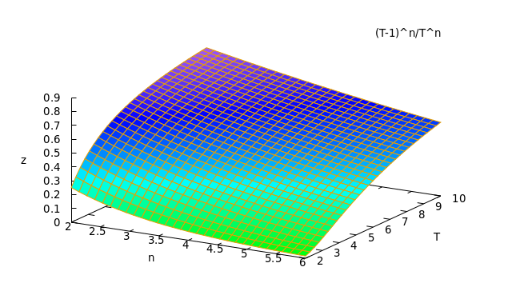

# Single letter: Win probability



Take *n* randomly chosen times

* Assume first one is the lowest time (*1/n* chance)
* First time is *x*
  * chance is \\(\frac{dx}{T}\\)
* Rest (*n-1* people) all after *x+1* seconds
  * 0 if \\(x > T-1\\)
  * chance \\(\frac{T-(x+1)}{T}\\) for each
  * chance \\((\frac{T-(x+1)}{T})\^{n-1}\\) for all *n-1*
  * *n* different players could be first

So \\(p_{win}=\frac{n}{T} \int_{0}\^{T-1} (\frac{T-(x+1)}{T})\^{n-1}{dx}=(\frac{T-1}{T})^n\\)

-------------
```
Maxima 5.44.0 http://maxima.sourceforge.net
using Lisp GNU Common Lisp (GCL) GCL 2.6.12
Distributed under the GNU Public License. See the file COPYING.
Dedicated to the memory of William Schelter.
The function bug_report() provides bug reporting information.
(%i1) assume (n>1);
(%o1)                               [n > 1]
(%i2) assume (T>1);
(%o2)                               [T > 1]
(%i3) (n/T) * integrate( ( (T-(x+1) ) / T ) ^ (n-1) , x, 0, T-1) ,factor ;
                                          n
                                   (T - 1)
(%o3)                              --------
                                       n
                                      T
```


------------------
So probability goes down with increasing players (*n*) and up with increasing time (*T*).
