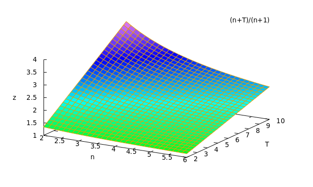

# Single letter: average time


* Using the assumptions from the previous page where \\(p_{win}=(\frac{T-1}{T})\^n\\)
  * For first time = *x*
  * Time when win is known is one second later = *x+1*
* This is **the time given a win** (no crash).
  * The time must be normalized to the probablity of a win


So \\(p_{win}*t_{win}=\frac{n}{T} \int_{0}\^{T-1} (x+1)(\frac{T-(x+1)}{T})\^{n-1}{dx}=\frac{T+n}{n+1}(\frac{T-1}{T})^n=\frac{T+n}{n+1}p_{win}\\)

\\(t_{win}=\frac{T+n}{n+1}\\)

-----------
```
twin:(n/T)*integrate((x+1)*(T-(x+1))^(n-1)/T^(n-1),x,0,T-1)/pwin,expand,factor;
                                     n + T
(%o7)                                -----
                                     n + 1
```


---------------
So the time increases with longer interval time (*T*).
The time *decreases* with increased players (*n*), since the first player's guess is more likely to be earlier.
