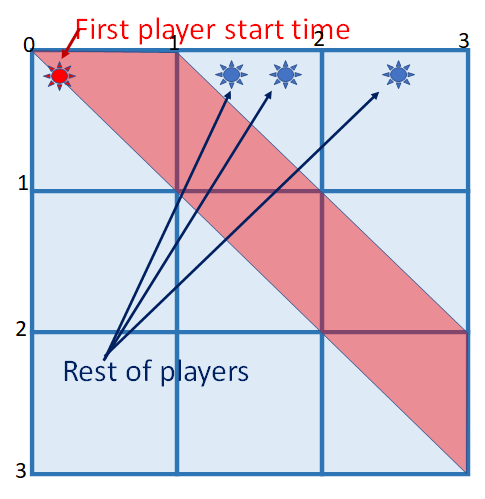

# Single letter win

We'll use the same graphical presentation, but modify it for multiple players.

* *n* random times from 0 to *T*
* "choose" the first one
* Are all the others >1 second later?

### Sorted order

Take n times sorted:

\\([t_1,t_2,...t_n]\\)

Chance all but first are in "safe" interval:

\\((\frac{T-1-t_1}{T})^{n-1}\quad\text{if  }t_1<{T-1}\\)

\\(0\quad\text{if  }t_1\geq{T-1}\\)

### Unsorted

There are *n!* ways to choose the the order, but we only care about the first one, and the rest can be in any order.

Thus \\(\binom{n}{1}=n\\)
